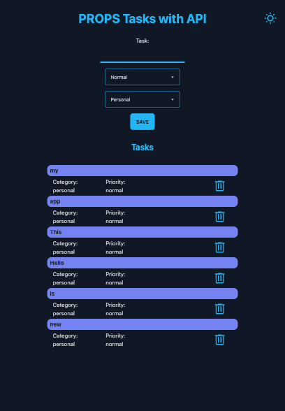
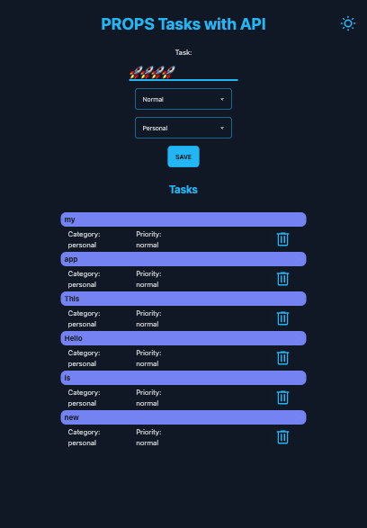
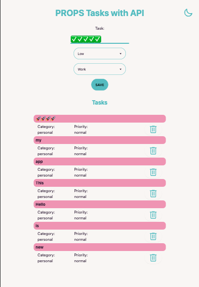
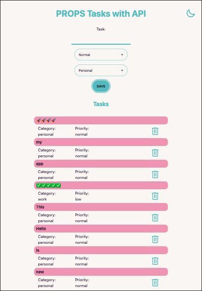

# React + Vite + Tailwind + daisyUI with API

For Now only, CRD from all basic operations of persistent storage. Comming soon "Update"

# [Api is in this Repository](https://github.com/MariaRiosNavarro/to_do_api_server)

# Dark

# Light

